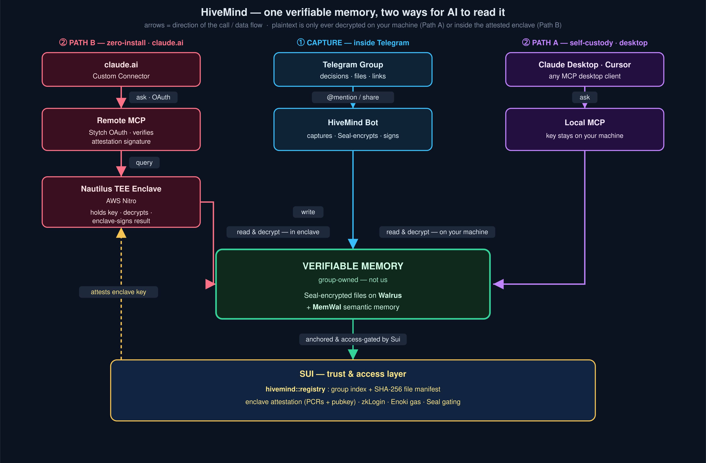

# 🐝 HiveMind

> Turn ephemeral group chats into a verifiable, portable AI memory — with zero user friction.

**Sui Overflow 2026 · Walrus track.** Built on Walrus, MemWal (Walrus Memory), Seal, Nautilus (TEE), zkLogin, and Enoki.

**🎥 Demo video → [youtu.be/td8tu_3lN1w](https://youtu.be/td8tu_3lN1w)** &nbsp;·&nbsp; **🤖 Try it live → [t.me/Sui_hivemind_bot](https://t.me/Sui_hivemind_bot)** (add it to a Telegram group)
**🔗 claude.ai connector:** `https://hivemind-mcp.onrender.com/mcp` &nbsp;·&nbsp; **Onboarding:** [hivemind-onboard.vercel.app](https://hivemind-onboard.vercel.app)

---

## The problem

Group chats are a black hole for data. Decisions, PDFs, links, and receipts get buried within hours. When you later want an AI (Claude, Cursor) to act on what the group decided, you're stuck hunting down files and copy-pasting hundreds of messages to rebuild context in another app.

## What HiveMind does

You invite **[@Sui_hivemind_bot](https://t.me/Sui_hivemind_bot)** into your existing Telegram group. It sits in the background and turns the group's decisions and shared files into a **verifiable, portable memory** stored on Walrus — owned by the group creator, not us.

Later, any AI tool plugs into that memory and can **recall the group's decisions and read the original files** — without anyone copy-pasting a thing. Two ways in: a **local, self-custody MCP** (Claude Desktop / Cursor) or a **zero-install claude.ai connector** backed by a confidential **Nautilus TEE enclave**.

## Architecture



One **capture** path and **two recall** paths converge on a single **group-owned, verifiable memory** — Seal-encrypted files on Walrus plus MemWal semantic memory — all anchored and access-gated on Sui by our `hivemind::registry` Move package (zkLogin sign-in, Enoki gas sponsorship, SHA-256 file manifest, delegate-key access).

- **① Capture** — the HiveMind bot watches the Telegram group, Seal-encrypts shared files, and writes decisions + artifacts into the group's memory.
- **②a Recall · Path A (self-custody)** — Claude Desktop / Cursor talk to a **local MCP** that holds the delegate key and decrypts **on your own machine**. Maximum custody; needs a desktop MCP client.
- **②b Recall · Path B (zero-install, claude.ai)** — **claude.ai** connects (OAuth) to a hosted **remote MCP**, which forwards recall to a **Nautilus TEE enclave** (AWS Nitro). The enclave holds the key, decrypts **inside the enclave**, and returns an **enclave-signed** result; the remote MCP **verifies that signature against the enclave key attested on-chain** before returning anything. So even the web tier is *"not even us"* — the operator, host, and root cannot read group plaintext.

Plaintext is only ever decrypted **on the member's own machine (Path A)** or **inside the attested enclave (Path B)** — never on a server an operator can read.

---

## Who it's for — value at a glance

**Value proposition:** group chats are where decisions actually happen — and where they're instantly lost. HiveMind turns that throwaway context into a **verifiable, portable memory the group owns**, so any AI can act on what was decided without a human re-assembling context by hand.

| User Persona | Real-World Scenario | Quantifiable Impact |
|---|---|---|
| **Early-stage startup / small dev team** | Architecture and product calls get made in the Telegram group, then buried. To get Claude or Cursor to build the agreed design, someone re-pastes scattered messages and re-uploads the spec into every new AI session. | **~3–5 hrs/week per dev** reclaimed from rebuilding context; every new AI session starts with full project memory in seconds, not minutes of copy-paste. |
| **Freelance agency ↔ client group** | Clients drop briefs, brand assets and `final_v3.pdf` into the chat; weeks later nobody can find which file or which decision was approved, sparking scope disputes. | Every file is **hash-anchored and recallable on demand** — kills "where's that file?" churn and scope-creep arguments; approvals resolved by proof, faster sign-off. |
| **Web3 DAO / community organizer** | Governance and treasury decisions happen in Telegram with no durable, tamper-proof record; members later dispute "what was actually agreed." | A **verifiable, on-chain-anchored decision log** — disputes settled by cryptographic proof, not memory; full auditable history with zero extra tooling. |
| **Distributed team across time zones** | Decisions get made while half the team sleeps; the other half spends the morning catching up or pinging around for context. | Replaces async catch-up threads — recall the night's decisions instantly; **~2–3 fewer sync calls/week** spent just re-establishing context. |
| **Hackathon / student build team** | A fast 2–4 person team builds with AI on different laptops; each person's Claude/Cursor has no idea what the others decided or which files were shared. | A new teammate's AI is productive in **under 1 minute** from a single config paste — one shared, portable memory across every machine, no re-onboarding. |
| **Open-source maintainer / mod team** | Design rationale and shared resources live in chat history a new contributor can't search; maintainers re-explain the same context again and again. | New-contributor ramp from **days to minutes** — their AI reads the group's real decisions and documents directly; far less repeated maintainer hand-holding. |

---

## Status — what's working (proven on Sui testnet)

| Flow | What it does | State |
|---|---|---|
| **On-chain registry (our Move pkg)** | `hivemind::registry` indexes groups + a verifiable artifact manifest (SHA-256 anchors) on Sui | ✅ deployed + live E2E |
| **Onboarding** | Creator owns a per-group `MemWalAccount` via Google zkLogin (Enoki-sponsored) **and the group is registered on-chain** | ✅ live E2E |
| **Ingestion** | files → Seal-encrypted Walrus blob + MemWal memory + **on-chain artifact manifest** (bot-signed, Enoki-sponsored) | ✅ live |
| **Seal-encrypted artifacts** | Files are Seal-encrypted before Walrus; decryption gated by the group's on-chain `seal_approve` | ✅ live E2E |
| **Path A — `hivemind-read` MCP** | Claude Desktop/Cursor recall group memory + read (decrypt) the original Walrus files, self-custody | ✅ live |
| **Path B — Nautilus TEE + claude.ai** | recall runs **inside an AWS Nitro enclave** holding the key; results are enclave-signed and verified against the **on-chain-attested** key. Zero-install **claude.ai** connector with Stytch OAuth + multi-group binding | ✅ live E2E (real Nitro enclave + on-chain attestation) |

---

## Deployed on Sui testnet

Every link is live on-chain — verify the package source, the group→memory index, the artifact hashes, and the enclave's attested key for yourself.

| Component | Id | Explorer |
|---|---|---|
| **`hivemind::registry`** — our Move package (group index + artifact manifest) | `0xe9a1e57c…896d8e` | [Suiscan](https://suiscan.xyz/testnet/object/0xe9a1e57c815cb1f2bd8c54d1c5973b0f9c565e5c3fbacffae8d47c7052896d8e) |
| **`Registry`** — shared object (chat → `Group` → `MemWalAccount` + SHA-256 manifest) | `0xb058138c…347daa` | [Suiscan](https://suiscan.xyz/testnet/object/0xb058138ce5a2fd3542c25e7ce2e58e9e6848aa747cee996182b43cfb8b347daa) |
| **`app::hivemind`** — Nautilus enclave registration + recall verifier | `0xa583af30…f702b` | [Suiscan](https://suiscan.xyz/testnet/object/0xa583af305a9edd07dbb3b67bceda94ee97a4b225f48c8e06a9a07d9ab5ef702b) |
| **`Enclave<HIVEMIND>`** — live attested enclave (signing key `ddaa9c7d…`) | `0xe09f6a82…5668` | [Suiscan](https://suiscan.xyz/testnet/object/0xe09f6a82625f661ff53311068558b0c0d96d74790417407e52ae92bd94975668) |
| **Nautilus enclave framework** | `0x8ecf22e7…9e49` | [Suiscan](https://suiscan.xyz/testnet/object/0x8ecf22e78c90c3e32833d76d82415d7e4227ea370bec4efdad4c4830cbda9e49) |
| **MemWal** (Walrus Memory) — dependency we build on | `0xcf6ad755…29c6` | [Suiscan](https://suiscan.xyz/testnet/object/0xcf6ad755a1cdff7217865c796778fabe5aa399cb0cf2eba986f4b582047229c6) |

Our contract source + tests: [packages/contracts/hivemind](packages/contracts/hivemind).

---

## Usage

**Try the live bot: [t.me/Sui_hivemind_bot](https://t.me/Sui_hivemind_bot)**

### 1 · Capture (in Telegram)
1. Add **[@Sui_hivemind_bot](https://t.me/Sui_hivemind_bot)** to your group → it DMs the creator a setup link.
2. Creator opens it → **Sign in with Google** → the group's memory account is created on Sui (gas sponsored by Enoki; the creator owns the keys).
3. In the group, **@mention the bot** to remember a decision — *"@Sui_hivemind_bot we ship June 25"* — or **drop a file**. The bot reacts 👍 when it captures.

### 2 · Recall — Path A: Claude Desktop / Cursor (self-custody)
1. A member taps the bot's **🤖 Connect → Connect local AI** (or `/connect`); the owner approves with one tap.
2. The bot DMs the member a delegate key + a ready-to-paste MCP config.
3. Paste it into your MCP client and ask: *"recall what the group decided, and read the spec file."*
   The delegate key and all decryption stay **on your machine**.

### 3 · Recall — Path B: claude.ai (zero-install)
1. In the group, tap **🤖 Connect → Connect to Claude.ai** → open the bind link → sign in.
2. In **claude.ai → Settings → Connectors → Add custom connector**, paste the connector URL and authorize:
   ```
   https://hivemind-mcp.onrender.com/mcp
   ```
3. Ask: *"use hivemind to recall the ship date."* The recall runs inside the **attested Nautilus enclave**; the result is enclave-signed and verified on-chain before you see it.

> If recall ever fails with a generic error, the connector's OAuth token has gone stale — **disconnect & reconnect** the connector in claude.ai to mint a fresh one.

---

## Setup (run it yourself)

**Prerequisites:** Node 20+, pnpm. (Rust + [Sui CLI](https://docs.sui.io/references/cli) for the contracts/enclave.)

### Bot + onboarding
Copy `.env.example` → `.env` and fill in `BOT_TOKEN` (BotFather), `GOOGLE_CLIENT_ID` + `ENOKI_API_KEY` (public, for the SPA), and `ENOKI_PRIVATE_API_KEY` (server-side sponsorship). The SPA reads its own `packages/onboard/.env`.

```bash
pnpm install
pnpm bot        # Telegram bot + onboarding backend
pnpm onboard    # onboarding SPA on :5173 (second terminal)
```

**BotFather:** `/newbot` → token; `/setprivacy` → **Disable** (so the bot sees group messages).

### Path A — the local MCP server (`hivemind-memory-mcp`)
Ships as a standalone npm package, so a member can run it on any machine with no checkout. The `/connect` flow DMs this exact config pre-filled:

```jsonc
// claude_desktop_config.json
{ "mcpServers": { "hivemind": {
  "command": "npx", "args": ["-y", "hivemind-memory-mcp"],
  "env": { "HIVEMIND_DELEGATE_KEY": "…", "HIVEMIND_ACCOUNT_ID": "0x…",
           "HIVEMIND_NAMESPACE": "<chat id>", "HIVEMIND_NETWORK": "testnet" }
}}}
```

`read_artifact` decrypts the Seal-encrypted blob and **extracts readable text** (PDF → text), so the AI reads the real document. Publish: `cd packages/mcp && pnpm build && npm publish --access public`.

### Path B — the confidential enclave (local loop, no AWS needed)
The same code runs on a free local loop — the Rust enclave does real recall against the testnet relayer, and an MCP client pulls verified, attested results end to end:

```bash
# 1) enclave app (debug; real attestation needs Nitro hardware)
cd enclave/src/nautilus-server
API_KEY=unused MEMWAL_SERVER_URL=https://relayer-staging.memory.walrus.xyz \
  HIVEMIND_ACCOUNT_ID=0x… HIVEMIND_DELEGATE_KEY=… \
  cargo run --features hivemind          # :3000

# 2) claude.ai-facing remote MCP, pointed at the enclave
ENCLAVE_URL=http://localhost:3000 HIVEMIND_NAMESPACE=<chat id> \
  pnpm --filter @hivemind/remote-mcp start    # :8787

# 3) drive it with an MCP client → verified, attested recall
pnpm --filter @hivemind/remote-mcp test-client "what did we decide?"
```

For the **real AWS Nitro + on-chain attestation** deploy (`register_enclave`, PCR pinning, Render hosting, Stytch wiring), see [enclave/DEPLOYMENT.md](enclave/DEPLOYMENT.md) and [RENDER_DEPLOY.md](RENDER_DEPLOY.md).

### Contracts & runnable proofs (no Telegram needed)
```bash
cd packages/contracts/hivemind && sui move test   # our Move package tests

pnpm flow1           # create/reuse a MemWalAccount + delegate, remember→recall round-trip
pnpm flow2           # file→Walrus→memory, text→memory, recall, artifact read-back
pnpm seal-test       # plaintext→Seal encrypt→Walrus (ciphertext only)→decrypt via seal_approve
pnpm chain-test      # our Move pkg: register_group + record_artifact + read manifest, live on testnet
pnpm namespace-test  # two groups, one account → each recalls only its own memory (no leakage)
```

---

## Built with

Sui Move · [Walrus](https://walrus.xyz) · [MemWal / Walrus Memory](https://github.com/MystenLabs/MemWal) · [Seal](https://seal.mystenlabs.com) · [Nautilus (TEE)](https://docs.sui.io/concepts/cryptography/nautilus) · zkLogin · [Enoki](https://portal.enoki.mystenlabs.com) · [MCP](https://modelcontextprotocol.io) · Rust · TypeScript · telegraf · React/Vite
